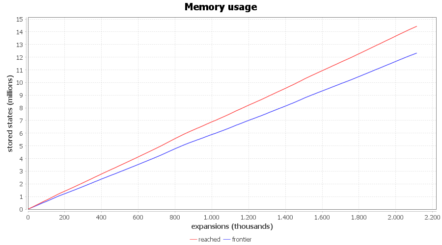

# Results and Evaluation of Search Algorithms
Evaluation follows the four criteria by Russell and Norvig (2020): Completeness, Cost Optimality, Time Complexity and Space Complexity.
Each algorithm is assessed both theoretically (what the algorithm guarantees) and empirically (measurements on benchmark instances).

- b ... branching factor (the number of operations that can be scheduled next)
- n ... number of operations to be scheduled
- d ... search depth, which equals the total number of operations (n times m)

### 1. Greedy Best-First Search (GBFS)
In GBFS, the frontier is ordered by the heuristic h(n), without g(n).
The heuristic used is MakespanEstimateHeuristic.
For each job it computes the time already spent in the shop plus the sum of the remaining nominal processing times and it takes the maximum over all jobs.
This value is a lower bound on the remaining time and ignores machine contention

#### 1.1 Theoretical Evaluation
| Criterion | GBFS                          | Justification |
|-----------|-------------------------------|---------------|
| Completeness | Completed, but memory bounded | The JSSP state space is finite and acyclic. Every action advances one job pointer, so no state is ever reached twice. With a reached set, GBFS therefore finds a solution if enough memory is available. In practice memory is exhausted before a goal is reached. |
| Cost Optimality | No | GBFS orders states by h(n) only and ignores the accumulated cost g(n). The first complete schedule it finds is generally not the one with the minimal makespan. |
| Time Complexity | Exponential in worst case, O(b^d) | Without g(n), there is no guarantee that the search descends toward a goal. With reached deduplication the runtime is bounded by the number of distinct reachable states, which is smaller than b^d but still exponential in the problem size. |
| Space Complexity | Exponential, O(b^d) | GBFS keeps every reached state in reached and the entire frontier in the priority queue. Both grow with the number of distinct states. This is the binding limit and the cause of the OutOfMemoryError. |

#### 1.2 Empirical Evaluation
Measured on three instances.

| Instance        | Size | GBFS result | Observation |
|-----------------|------|-------------|-------------|
| custom ea01 2x2 | 2 jobs, 2 machines, 4 ops | Makespan 6 (optimal), instant | The state space is tiny, so GBFS terminates correctly. Used as a correctness test. |
| ft06 | 6 jobs, 6 machines, 36 ops | Out of memory | After about 2.6 million expansions it had only reached depth 30 of 36, with more than 8.9 million states in reached and still growing. No goal reached. |
| la02 | 10 jobs, 5 machines, 50 ops | Out of memory | After about 1 million expansions it had only reached depth 32 of 50, with roughly 6.9 million states in reached. No goal reached. |

The central observation is that instance size only shifts the limit and does not remove the
problem.
Java VM terminated with OutOfMemoryError before the goal state was reached.
The OutOfMemoryError occurs on both standard benchmarks.

The following two plots illustrate the run on **ft06** 

#### Plot 1

Memory usage over the course of the search.
The x-axis shows the number of expansions (in thousands), the y-axis the number of stored states (in millions).
Both curves grow continuously and without bound, almost linearly in the number of expansions. 
reached stays above frontier because nothing is ever removed from reached, whereas the frontier loses exactly one node on every expansion. 
The frontier therefore tracks reached subtracted with the number of expansions and the gap between the two widens over time.
This confirms the theoretical space complexity of O(b^d): memory consumption is driven by the number of distinct states and there is no mechanism that limits it before the process runs out of heap.

#### Plot 2

Search depth over the course of the search.
The x-axis again shows the number of expansions (in thousands), the y-axis the maximum search depth reached so far.
The goal depth for ft06 is 36 operations, shown as the gray horizontal line.
The curve rises early on but then flattens into long plateaus where additional expansions no longer increase the maximum depth.
This is the plateau effect. Sibling states share the same heuristic value, so GBFS keeps expanding states at the same depth instead of descending toward the goal. 
The curve stalls at depth 32 and never reaches the goal depth of 36 before the process runs out of memory.

#### 1.3 Interpretation
The OutOfMemoryError is not an implementation defect, since the algorithm is tested on an instance and works correctly.
The GBFS algorithm stores all reached states.
Because the number of possible partial schedules in the JSSP grows exponentially with the problem size, memory is exhausted
on realistic instances before a goal is reached.

The value max(remaining time over jobs) often does not change between sibling states, because the maximum over the jobs stays the same when an operation of a different job is scheduled.
This leads to large plateaus of states with identical heuristic values.
GBFS can no longer distinguish between them and explores the plateau almost breadth first instead of descending toward a goal.
A tie break by depth was tested and did not solve the problem, because ordering the frontier does not bound the memory. All states remain in reached and in the frontier.

### 1.4 Consequence
GBFS is useful as a reference on small instances.
2x2 instance confirms that the modelling and the makespan computation are correct.
However, it does not scale to standard benchmarks.

Further steps:
- Memory bounded methods that do not keep all states such as Beam Search or constructive greedy scheduling with O(d) memory.
- For optimal solutions on small instances A*, which has the same space limitation. It serves only as an exact reference on small instances.
- For large instances in the long term, local search and metaheuristics such as Hill Climbing, Tabu Search or Simulated Annealing, which work in the space of complete schedules and need constant memory.

GBFS shows empirically why plain state space search alone is not sufficient.