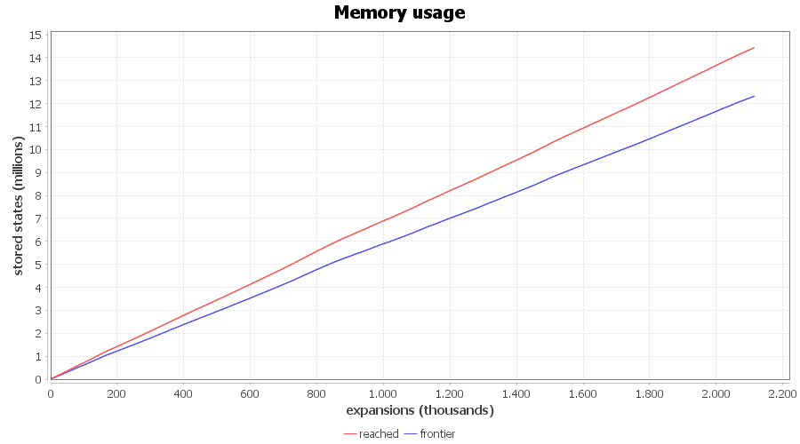
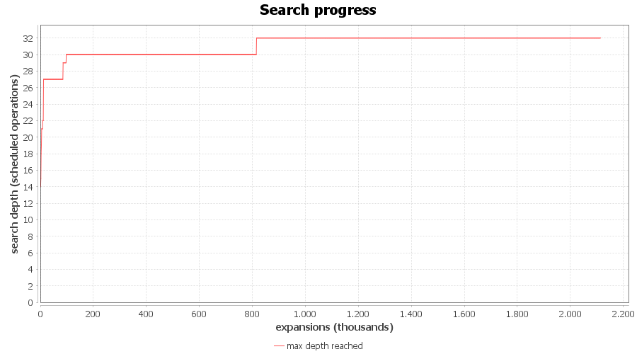
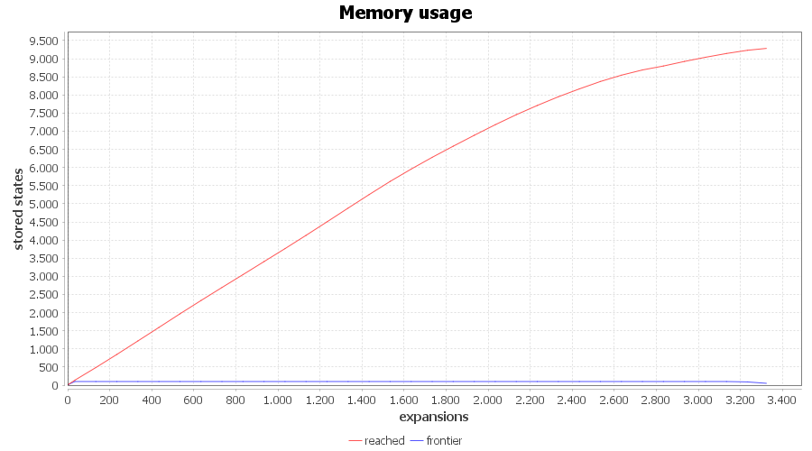
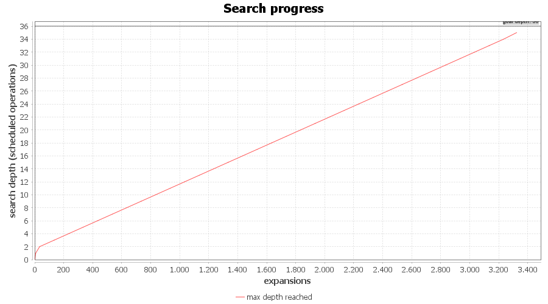

# Results and Evaluation of Search Algorithms
Evaluation follows the four criteria by Russell and Norvig (2020): Completeness, Cost Optimality, Time Complexity and Space Complexity.
Each algorithm is assessed both theoretically (what the algorithm guarantees) and empirically (measurements on benchmark instances).

- b ... branching factor (the number of operations that can be scheduled next)
- n ... number of jobs
- d ... search depth, which equals the total number of operations (n times m)

### 1. Greedy Best-First Search (GBFS)
In GBFS, the frontier is ordered by the heuristic h(n), without g(n).
The heuristic used is MakespanEstimateHeuristic.
For each job it computes the time already spent in the shop plus the sum of the remaining nominal processing times and it takes the maximum over all jobs.
This value is a lower bound on the remaining time and ignores machine contention

#### 1.1 Theoretical Evaluation
| Criterion | GBFS                          | Justification                                                                                                                                                                                                                                                                                                                                                                                             |
|-----------|-------------------------------|-----------------------------------------------------------------------------------------------------------------------------------------------------------------------------------------------------------------------------------------------------------------------------------------------------------------------------------------------------------------------------------------------------------|
| Completeness | Completed, but memory bounded | The JSSP state space is finite and acyclic. Every action advances one job pointer, so the sum of the job pointers strictly increases and no state can be revisited along a path. The reached set deduplicates states that several paths lead to. With a reached set, GBFS therefore finds a solution if enough memory is available. In practice memory is exhausted before a goal is reached. |
| Cost Optimality | No | GBFS orders states by h(n) only and ignores the accumulated cost g(n). The first complete schedule it finds is generally not the one with the minimal makespan.                                                                                                                                                                                                                                           |
| Time Complexity | Exponential in worst case, O(b^d) | Without g(n), there is no guarantee that the search descends toward a goal. With reached deduplication the runtime is bounded by the number of distinct reachable states, which is smaller than b^d but still exponential in the problem size.                                                                                                                                                            |
| Space Complexity | Exponential, O(b^d) | GBFS keeps every reached state in reached and the entire frontier in the priority queue. Both grow with the number of distinct states. This is the binding limit and the cause of the OutOfMemoryError.                                                                                                                                                                                                   |

#### 1.2 Empirical Evaluation
Measured on three instances.

| Instance        | Size | GBFS result | Observation                                                                                                                                                                                     |
|-----------------|------|-------------|-------------------------------------------------------------------------------------------------------------------------------------------------------------------------------------------------|
| custom ea01 2x2 | 2 jobs, 2 machines, 4 ops | Makespan 6 (optimal), instant | The state space is tiny, so GBFS terminates correctly. Used as a correctness test.                                                                                                              |
| ft06 | 6 jobs, 6 machines, 36 ops | Out of memory | After about 2.1 million expansions it had reached a depth of only 32 of 36, with about 14.5 million states in reached (and about 12.3 million in the frontier), still growing. No goal reached. |
| la02 | 10 jobs, 5 machines, 50 ops | Out of memory | After about 1 million expansions it had only reached depth 32 of 50, with about 6.9 million states in reached. No goal reached.                                                                 |

The central observation is that instance size only shifts the limit and does not remove the problem.
Java VM terminated with OutOfMemoryError before the goal state was reached.
The OutOfMemoryError occurs on both standard benchmarks.

The following two plots illustrate the run on **ft06**

#### Plot 1

Memory usage over the course of the search.
The x-axis shows the number of expansions (in thousands), the y-axis the number of stored states (in millions).
Both curves grow continuously and without bound, almost linearly in the number of expansions.
reached stays above frontier because nothing is ever removed from reached, whereas the frontier loses exactly one node on every expansion.
The frontier therefore tracks reached minus the number of expansions and the gap between the two widens over time.
This confirms the theoretical space complexity of O(b^d): memory consumption is driven by the number of distinct states and there is no mechanism that limits it before the process runs out of heap.

#### Plot 2

Search depth over the course of the search.
The x-axis again shows the number of expansions (in thousands), the y-axis the maximum search depth reached so far.
The goal depth for ft06 is 36 operations.
The curve rises early on but then flattens into long plateaus where additional expansions no longer increase the maximum depth.
This is the plateau effect. Sibling states share the same heuristic value, so GBFS keeps expanding states at the same depth instead of descending toward the goal.
The curve stalls at depth 32 and never reaches the goal depth of 36 before the process runs out of memory.

#### 1.3 Interpretation
The OutOfMemoryError is not an implementation defect, since the algorithm is tested on an instance and works correctly.
The GBFS algorithm stores all reached states.
Because the number of possible partial schedules in the JSSP grows exponentially with the problem size, memory is exhausted
on realistic instances before a goal is reached.

The value max(remaining time over jobs) often does not change between sibling states, because the maximum over the jobs stays the same when an operation of a different job is scheduled.
This leads to large plateaus of states with identical heuristic values.
GBFS can no longer distinguish between them and explores the plateau almost breadth first instead of descending toward a goal.
A tie break by depth was tested and did not solve the problem, because ordering the frontier does not bound the memory. All states remain in reached and in the frontier.

### 1.4 Consequence
GBFS is useful as a reference on small instances.
2x2 instance confirms that the modelling and the makespan computation are correct.
However, it does not scale to standard benchmarks.

Further steps:
- Memory bounded methods that do not keep all states such as Beam Search or constructive greedy scheduling with O(d) memory.
- For optimal solutions on small instances A*, which has the same space limitation. It serves only as an exact reference on small instances.
- For large instances in the long term, local search and metaheuristics such as Hill Climbing, Tabu Search or Simulated Annealing, which work in the space of complete schedules and need constant memory.

GBFS shows empirically why plain state space search alone is not sufficient.

___

### 2. Beam Search
Beam Search is memory bounded. It explores the state space layer by layer.
In every layer it expands the current set of nodes (the beam), collects all their successors, orders them by h(n) and keeps only the k best successors for the next layer.
All other successors are discarded, so the beam never holds more than k nodes.
The parameter k is the beam width and controls the trade off between memory and solution quality.

The heuristic used is MakespanEstimateHeuristic.
As in GBFS, a reached set is kept for the whole search, not just for one layer, to remove duplicate states that several paths lead to.
For a large k Beam Search approaches GBFS and for k equal to 1 it schedules one operation at a time.

#### 2.1 Theoretical Evaluation

| Criterion | Beam Search                                    | Justification                                                                                                                                                                                                                                                                                                                                                                                                                                                                                                                           |
|-----------|------------------------------------------------|-----------------------------------------------------------------------------------------------------------------------------------------------------------------------------------------------------------------------------------------------------------------------------------------------------------------------------------------------------------------------------------------------------------------------------------------------------------------------------------------------------------------------------------------|
| Completeness | Incomplete in general (valid here)             | Because only the k best successors are kept, Beam Search can discard the only path that leads to a goal. Therefore, it is not complete in general. In this JSSP every complete schedule is a goal and every partial schedule can be extended by at least one available operation. As long as the beam is not emptied by duplicate elimination, the search descends one level per layer and reaches a complete schedule. A valid solution was found for every tested beam width.                                                         |
| Cost Optimality | No                                             | The beam keeps the states with the lowest h(n) and keeps at most k nodes per layer. The path to the minimal makespan can be pruned away. The makespan found is a valid upper bound that improves with larger k but is not guaranteed to be optimal.                                                                                                                                                                                                                                                                                     |
| Time Complexity | O(d * k * b)                                   | Per layer at most k nodes are expanded and each generates at most b successors, over d layers. The runtime is linear in depth and beam width.                                                                                                                                                                                                                                                                                                                                                                                           |
| Space Complexity | Beam (frontier) O(k), reached set O(d * k * b) | Between layers only the k best nodes are kept in the beam, so the frontier is bounded by the beam width and independent of problem size. While one layer is expanded, up to k * b candidate successors exist briefly before pruning. The reached set is never cleared during the search, exactly like in GBFS, so it accumulates every distinct state generated over all d layers. It is the dominating memory term here, but stays far smaller than in GBFS because only k nodes are expanded per layer instead of the whole frontier. |

#### 2.2 Empirical Evaluation
Measured on two standard instances for five beam widths.
Every run terminated with a valid and complete schedule.

ft06

| k | makespan | gap to optimum | expansions | reached (states) | frontier at goal (states) | valid |
| --- | -------- | -------------| -----------| ----------------- | -----------------| ------ |
| 1 | 136 | +147% | 36 | 129 | 1 | yes |
| 5 | 109 | +98% | 176 | 566 | 5 | yes |
| 20 | 89 | +62% | 687 | 2014 | 14 | yes |
| 50 | 86 | +56% | 1683 | 4763 | 32 | yes |
| 100 | 78 | +42% | 3323 | 9282 | 51 | yes |

la02

| k | makespan | gap to optimum | expansions | reached (states) | frontier at goal (states) | valid |
|-----|----------|----------------|------------|------------------|-------------------|-------|
| 1 | 1662 | +154% | 50 | 282 | 1 | yes |
| 5 | 1252 | +91% | 246 | 1343 | 4 | yes |
| 20 | 1044 | +59% | 971 | 5035 | 15 | yes |
| 50 | 1037 | +58% | 2409 | 12275 | 37 | yes |
| 100 | 933 | +42% | 4773 | 23769 | 47 | yes |

The frontier column reports the beam size at the layer where the goal was found, not the nominal width k.
For most of the search the beam is filled to exactly k, because enough distinct successor states exist.
Only in the last few layers, when few jobs still have remaining operations, does the number of distinct successors drop below k and the beam shrinks below its nominal width. This is expected and does not indicate a fault: the beam width k is an upper bound on the frontier, not a fixed size.

The central observations are:
- Beam Search returns a valid schedule on both instances.
- The frontier never exceeds the beam width k and stays at k for almost the whole search. Memory stays bounded and small, in the low thousands of states for the reached set. In comparison, GBFS had millions of reached states.
- A larger k lowers the makespan but increases expansions, reached states and runtime. On ft06 the makespan improves only from 86 to 78 between k = 50 and k = 100, while the number of expansions almost doubles.
- At k = 100 the makespan stays about 42% above the known optimum on both instances, which reflects the greedy and non-optimal nature of the search.

The following two plots illustrate the run on ft06 with beam width k = 100.

#### Plot 1

Memory usage over the course of the search.
The x-axis shows the number of expansions, the y-axis the number of stored states.
The frontier is the lower line. It stays flat at the beam width and never grows beyond k = 100.
The number of nodes carried from one layer to the next is bounded by k and is independent of how far the search has progressed.
The reached line rises almost linearly, because every newly generated state is added to the reached set and nothing is removed.
Therefore, the reached set is the part of memory that grows, but it stays in the low thousands.

#### Plot 2

Search depth over the course of the search.
The x-axis again shows the number of expansions, the y-axis the maximum search depth reached so far.
The goal depth for ft06 is 36 operations.
The curve rises steadily and reaches the goal depth without long plateaus.
Because only k nodes survive each layer, the search cannot spread out breadth first over a plateau of states with equal heuristic values.
It is forced to move on the next layer.
Therefore, the curve climbs to a complete schedule instead of stalling.

#### 2.3 Interpretation
Beam Search only keeps k nodes per layer.
On both benchmarks it returns a valid schedule where GBFS fails and it does so with a bounded and small frontier.
The price is solution quality.
Pruning by h(n) alone discards promising branches and the plateaus in the heuristic mean that the k retained nodes are often not the ones on an optimal path.
As a result the makespan is only an upper bound and stays well above the optimum.

Increasing beam width k improves quality and increases cost roughly linearly, with diminishing returns.
A small k is fast and light but greedy, while a large k approaches behaviour of GBFS.
